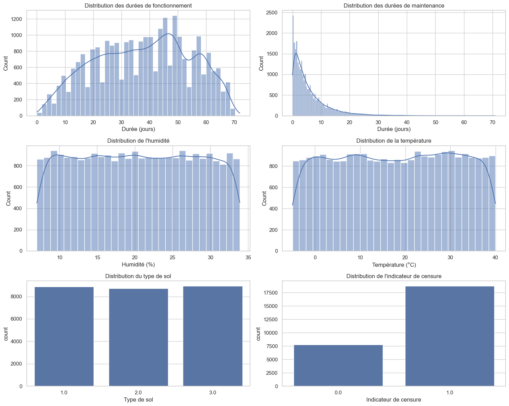
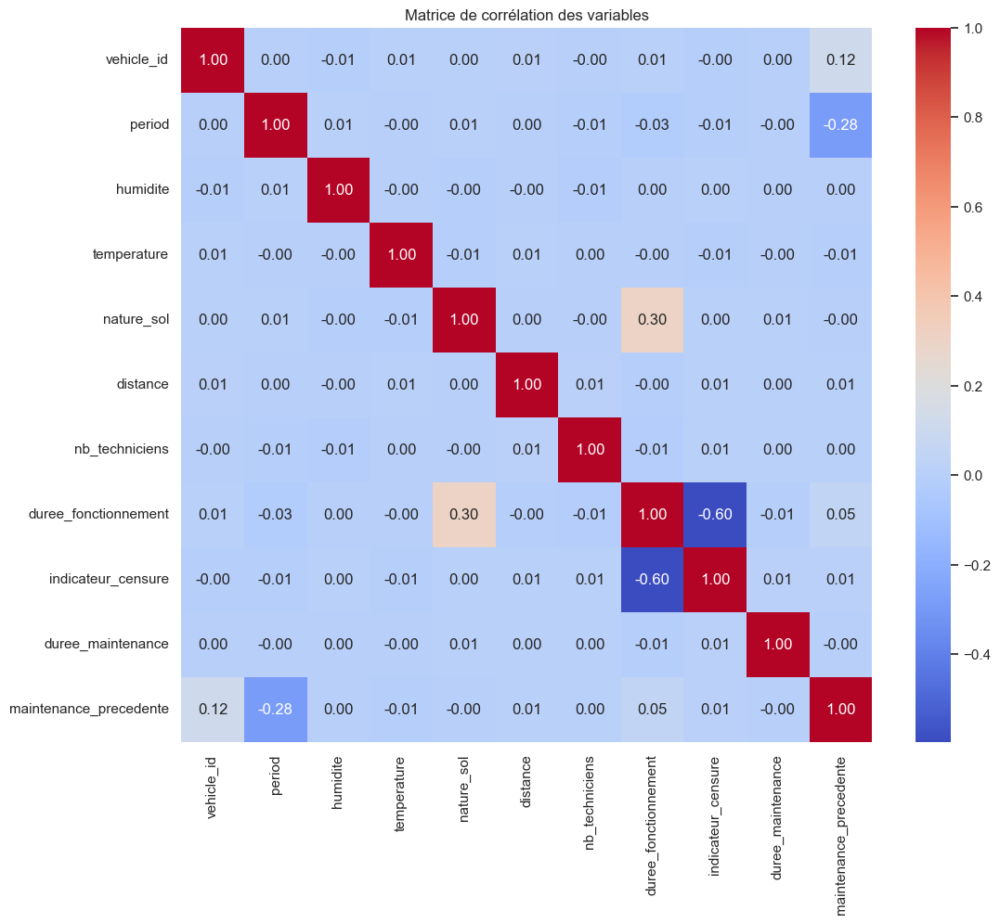
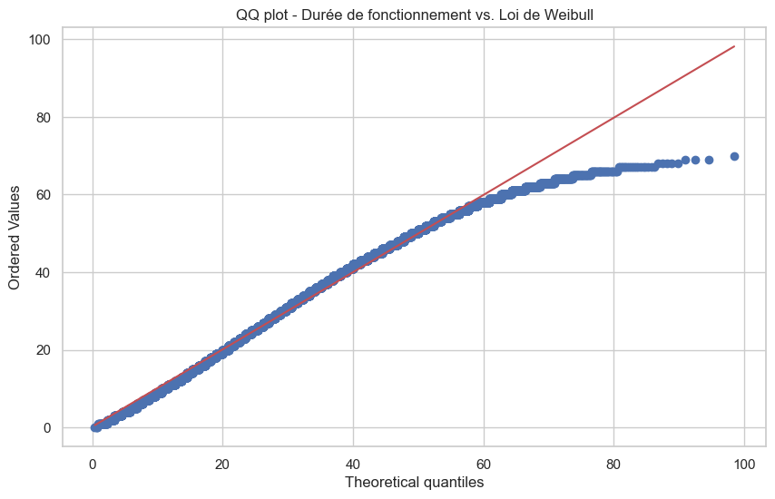
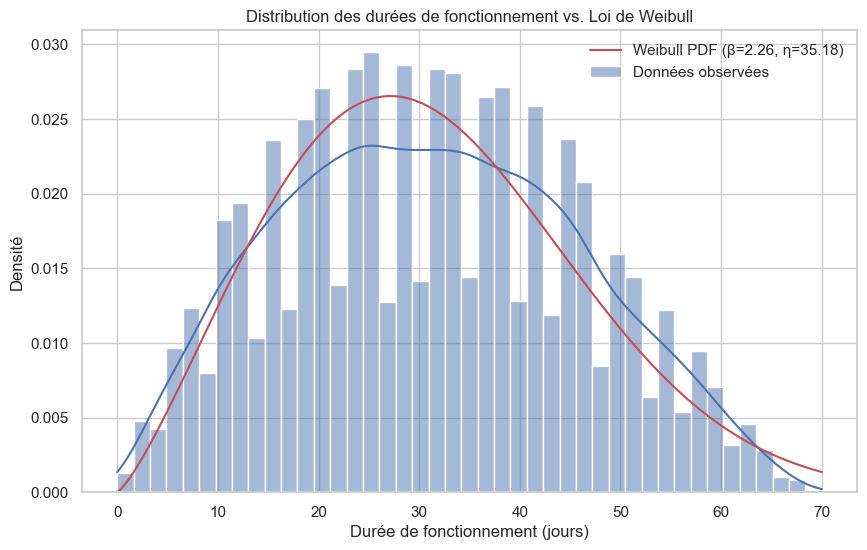
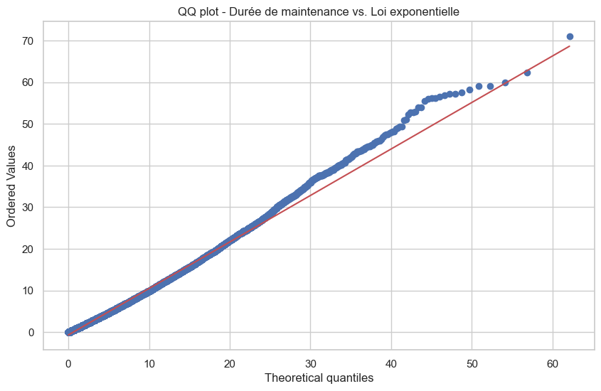
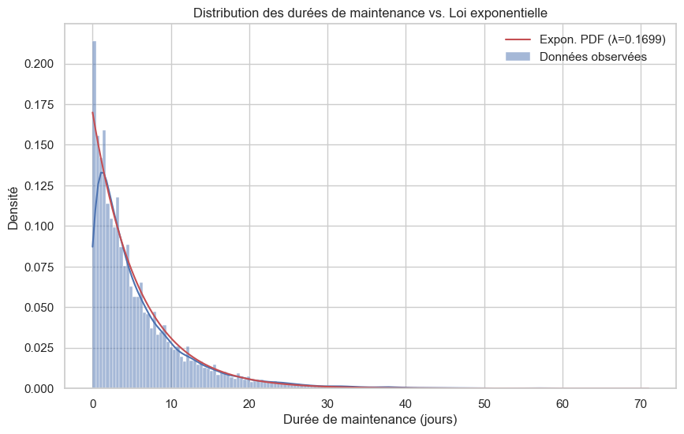
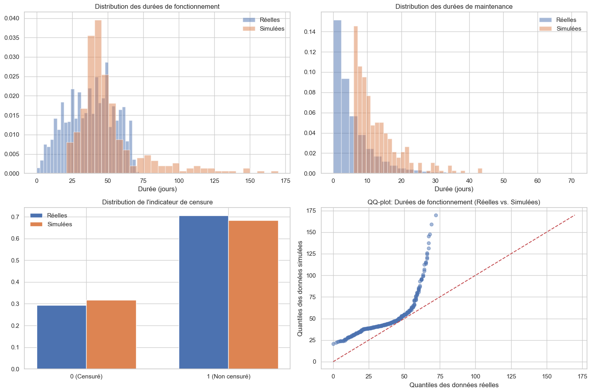

# Estimation Bayésienne de la Durée de Fonctionnement des Véhicules de Chantier

Projet de recherche M2 2025 - Stephen Cohen

## Résumé

Dans ce rapport, nous développons une approche bayésienne pour l'estimation de la durée de fonctionnement des véhicules de chantier dans un contexte assurantiel. Notre modèle prend en compte la structure séquentielle des périodes de fonctionnement et de maintenance, ainsi que l'influence des covariables environnementales. Nous construisons un modèle hiérarchique combinant des lois de Weibull et exponentielles, dont les paramètres sont estimés par des approches classiques (maximum de vraisemblance) et bayésiennes. Cette modélisation nous permet de quantifier l'incertitude associée aux prédictions et de fournir des recommandations précises pour les contrats d'assurance.

---

- [Estimation Bayésienne de la Durée de Fonctionnement des Véhicules de Chantier](#estimation-bayésienne-de-la-durée-de-fonctionnement-des-véhicules-de-chantier)
  - [Résumé](#résumé)
- [Introduction](#introduction)
  - [Contexte](#contexte)
  - [Formalisation du problème](#formalisation-du-problème)
- [Description des données](#description-des-données)
  - [Statistiques descriptives](#statistiques-descriptives)
  - [Analyse des distributions](#analyse-des-distributions)
  - [Corrélation entre variables](#corrélation-entre-variables)
  - [Relations entre variables explicatives et variables cibles](#relations-entre-variables-explicatives-et-variables-cibles)
- [Modélisation](#modélisation)
  - [Choix des modèles probabilistes](#choix-des-modèles-probabilistes)
  - [Adéquation des lois théoriques](#adéquation-des-lois-théoriques)
  - [Specification des fonctions $g\_1$ et $g\_2$](#specification-des-fonctions-g_1-et-g_2)
  - [Formulation Bayésienne](#formulation-bayésienne)
- [Estimation et inférence](#estimation-et-inférence)
  - [Maximum de vraisemblance](#maximum-de-vraisemblance)
  - [Modèles neuronaux](#modèles-neuronaux)
  - [Comparaison des modèles](#comparaison-des-modèles)
- [Analyse des résultats](#analyse-des-résultats)
  - [Importance des covariables](#importance-des-covariables)
  - [Analyse de sensibilité](#analyse-de-sensibilité)
  - [Inférence Bayésienne](#inférence-bayésienne)
  - [Validation sur données simulées](#validation-sur-données-simulées)
- [Application assurantielle](#application-assurantielle)
  - [Prédiction de durée de vie résiduelle](#prédiction-de-durée-de-vie-résiduelle)
  - [Quantification de l'incertitude](#quantification-de-lincertitude)
  - [Evaluation du risque et tarification](#evaluation-du-risque-et-tarification)
- [Conclusion](#conclusion)
  - [Synthèse des résultats](#synthèse-des-résultats)
  - [Limites et perspectives](#limites-et-perspectives)

---

# Introduction
## Contexte

Le problème de l'estimation de la durée de fonctionnement des véhicules de chantier présente des enjeux majeurs pour le secteur assurantiel. La complexité de cette estimation provient de la nature séquentielle des données (alternance de périodes de fonctionnement et de maintenance) et de la censure à droite inhérente aux observations (certains véhicules peuvent être retirés d'observation avant leur défaillance réelle).

Dans le domaine du BTP, les véhicules professionnels sont soumis à des conditions d'utilisation variables et parfois extrêmes, qui influencent leur durabilité et leur fiabilité. Pour les assureurs, la capacité à estimer précisément la durée de fonctionnement avant défaillance représente un avantage concurrentiel considérable pour la tarification des contrats d'assurance.

## Formalisation du problème

Pour un ensemble de véhicules professionnels, nous observons des successions de périodes de fonctionnement suivies de périodes de maintenance. 

Pour chaque véhicule i et période k, nous avons:

- $x_{i,k}$ : covariables du chantier (humidité, température, nature du sol)
- $y_{i,k}$ : durée de fonctionnement
- $\delta_{i,k}$ : indicateur de censure (1 si défaillance, 0 si censure)
- $\tilde{x}_{i,k}$ : covariables de maintenance (distance, nombre de techniciens)
- $t_{i,k}$ : temps de maintenance

Notre objectif est de modéliser:

1. La durée de fonctionnement $Y|X,T \sim \text{Weibull}(\eta = g_1(X,T,\theta_1), \beta)$
2. Le temps de maintenance $T|\tilde{X} \sim \text{Exponentielle}(\lambda = g_2(\tilde{X},\theta_2))$

où $g_1$ et $g_2$ sont des fonctions paramétrées par $\theta_1$ et $\theta_2$ respectivement.

Notre approche poursuit plusieurs objectifs :

1. Développer un modèle bayésien robuste pour estimer la durée de fonctionnement des véhicules de chantier, en tenant compte de la censure et des covariables
2. Évaluer l'influence des différentes covariables sur la durée de fonctionnement et la maintenance
3. Quantifier l'incertitude associée aux prédictions
4. Fournir des recommandations assurantielles (durée de couverture, évaluation du risque, tarification)
5. Valider le modèle par des simulations et analyses de sensibilité

# Description des données

Les données sont organisées par dimension et présentées dans plusieurs fichiers Excel. Chaque fichier correspond à une variable spécifique, avec une ligne par véhicule et une colonne par période. 
Les fichiers disponibles sont :

  **Covariables de chantier (X) :**

- `humidite.xlsx` : Humidité relative (en %)
- `temperature.xlsx` : Température (en °C)
- `nature_sol.xlsx` : Nature du sol (1 = sable, 2 = boue, 3 = terre souple, 4 = terre ferme)

    **Labels (Y et indicateur de censure) :**

- `durees_fonctionnement.xlsx` : Durées de fonctionnement (en jours)
- `indicateur_censure.xlsx` : Indicateur de censure (1 si vraie défaillance, 0 si censure)

    **Covariables de maintenance :**

- `distance.xlsx` : Distance à la ville la plus proche (en km)
- `nb_techniciens.xlsx` : Nombre de techniciens spécialisés sur le chantier
- `durees_maintenance.xlsx` : Durées de maintenance (en jours)

Pour faciliter l'analyse, nous avons transformé ces données du format large (une ligne par véhicule) au format long (une ligne par observation), en incluant une colonne pour la maintenance précédente.

## Statistiques descriptives

L'analyse des données nettoyées (après suppression des valeurs manquantes) révèle les caractéristiques suivantes :

| Variable | Moyenne | Écart-type | Min | 25% | 50% (Médiane) | 75% | Max |
|----------|---------|------------|-----|-----|---------------|-----|-----|
| Humidité | 20.41 | 7.78 | 7.0 | 13.7 | 20.4 | 27.1 | 33.9 |
| Température | 17.63 | 13.0 | -5.0 | 6.44 | 17.76 | 28.94 | 40.0 |
| Nature du sol | 2.00 | 0.82 | 1.0 | 1.0 | 2.0 | 3.0 | 3.0 |
| Distance | 29.55 | 17.29 | 0.0 | 14.0 | 30.0 | 45.0 | 59.0 |
| Nb techniciens | 1.49 | 0.50 | 1.0 | 1.0 | 1.0 | 2.0 | 2.0 |
| Durée fonctionnement | 37.62 | 16.68 | 0.0 | 24.0 | 39.0 | 50.0 | 72.0 |
| Indicateur censure | 0.71 | 0.46 | 0.0 | 0.0 | 1.0 | 1.0 | 1.0 |
| Durée maintenance | 5.89 | 6.59 | 0.0 | 1.5 | 3.7 | 7.9 | 71.0 |
| Maintenance précédente | 44.04 | 186.44 | 0.0 | 1.6 | 4.1 | 9.1 | 1428.0 |

Sur l'ensemble des données, nous disposons de 26 531 observations complètes (sans valeurs manquantes) pour 1 427 véhicules différents. Environ 70.6% des observations correspondent à de vraies défaillances (non censurées).

## Analyse des distributions

L'analyse des distributions des variables principales révèle plusieurs points intéressants :

**Durée de fonctionnement :** La distribution présente une forme relativement symétrique, avec un pic autour de 40 jours. Cette distribution semble compatible avec une loi de Weibull, une hypothèse que nous vérifierons formellement.

**Durée de maintenance :** Cette variable présente une distribution fortement asymétrique à droite, avec une concentration de valeurs près de zéro et une longue queue. Ce type de distribution est caractéristique d'une loi exponentielle.

**Humidité et température :** Ces deux variables présentent des distributions uniformes sur leurs plages respectives, indiquant une bonne diversité des conditions climatiques dans notre jeu de données.

**Nature du sol :** Les observations se répartissent de manière relativement équilibrée entre les trois premiers types de sol (sable, boue, terre souple), avec une absence de sol de type 4 (terre ferme) dans les données analysées.

**Indicateur de censure :** Environ 70% des observations correspondent à de vraies défaillances (δ=1), tandis que 30% sont censurées (δ=0), ce qui est un taux de censure raisonnable pour l'analyse de survie.

## Corrélation entre variables

La matrice de corrélation entre les variables montre :

1. Une corrélation positive significative (0.30) entre la durée de fonctionnement et la nature du sol, indiquant que les sols plus fermes (valeurs plus élevées) sont associés à des durées de fonctionnement plus longues.
2. Une corrélation négative (-0.60) entre la durée de fonctionnement et l'indicateur de censure, ce qui est logique car les observations censurées (δ=0) correspondent souvent à des arrêts prématurés du chantier, conduisant à des durées de fonctionnement plus courtes que les vraies défaillances.
3. Une faible corrélation entre les covariables météorologiques (humidité, température) et la durée de fonctionnement, suggérant que ces facteurs ont potentiellement un effet non-linéaire ou conditionnel.
4. Une corrélation positive modeste (0.05) entre la durée de fonctionnement et la maintenance précédente, indiquant qu'une maintenance plus longue pourrait légèrement améliorer la durée de fonctionnement suivante.

## Relations entre variables explicatives et variables cibles

L'analyse des relations bivariées entre les variables explicatives et les variables cibles a révélé plusieurs tendances :

- **Nature du sol et durée de fonctionnement :** Les boxplots montrent une augmentation claire de la durée médiane de fonctionnement avec la fermeté du sol. Les véhicules fonctionnent significativement plus longtemps sur des sols de type 3 (terre souple) que sur des sols de type 1 (sable).

- **Température et durée de fonctionnement :** Une légère tendance positive est observable, mais avec une grande dispersion. L'effet de la température semble modéré par rapport à d'autres facteurs.

- **Maintenance précédente et durée de fonctionnement :** On observe une légère tendance positive, mais avec beaucoup de dispersion. Une maintenance plus longue semble associée à une durée de fonctionnement légèrement plus élevée, mais cette relation n'est pas très marquée.

- **Distance et durée de maintenance :** La distance à la ville la plus proche ne semble pas avoir d'impact majeur sur la durée de maintenance, malgré une légère tendance positive.

- **Nombre de techniciens et durée de maintenance :** De manière surprenante, il n'y a pas de différence significative entre les durées de maintenance selon le nombre de techniciens (1 ou 2).

Ces observations préliminaires guideront le choix de nos modèles et l'interprétation des résultats.

# Modélisation
## Choix des modèles probabilistes

Pour modéliser les durées de fonctionnement et de maintenance, nous avons sélectionné deux distributions probabilistes adaptées aux données de survie :

1. **Loi de Weibull** pour la durée de fonctionnement (Y)

La loi de Weibull est particulièrement adaptée pour modéliser la durée de vie des équipements mécaniques. Sa fonction de densité s'écrit :

$$f_W(y|\eta, \beta) = \frac{\beta}{\eta}\left(\frac{y}{\eta}\right)^{\beta-1}e^{-\left(\frac{y}{\eta}\right)^{\beta}} \mathbb{1}_{\{y \geq 0\}}$$

où:
- $\eta > 0$ est le paramètre d'échelle (lié à la durée de vie caractéristique)
- $\beta > 0$ est le paramètre de forme qui contrôle la forme de la distribution

Pour notre modèle, nous supposons que $Y|X,T,\theta_1 \sim W(\eta = g_1(X,T,\theta_1), \beta)$ où $g_1$ est une fonction paramétrée par $\theta_1$ qui lie les covariables au paramètre d'échelle $\eta$.

1. **Loi exponentielle** pour la durée de maintenance (T)

La loi exponentielle, cas particulier de la loi de Weibull avec $\beta=1$, est souvent utilisée pour modéliser des temps d'attente ou de service. Sa fonction de densité est :

$$f_E(t|\lambda) = \lambda^{-1}e^{-\lambda t} \mathbb{1}_{\{t \geq 0\}}$$

où $\lambda > 0$ est le taux moyen d'événements. Pour notre modèle, nous supposons que $T|\tilde{X},\theta_2 \sim E(\lambda = g_2(\tilde{X},\theta_2))$ où $g_2$ est une fonction paramétrée par $\theta_2$.

## Adéquation des lois théoriques

Pour vérifier l'adéquation de nos choix de distributions, nous avons effectué des tests graphiques et d'ajustement.

**Pour la loi de Weibull (durée de fonctionnement) :**

- Estimation des paramètres sur les données non censurées : $\beta \approx 2.26$, $\eta \approx 35.18$
- Q-Q plot : Bonne adéquation pour la majorité des données, avec quelques déviations dans les queues de distribution

- Histogramme avec superposition de la densité : Correspondance visuelle satisfaisante

**Pour la loi exponentielle (durée de maintenance) :**

- Estimation du paramètre : $\lambda \approx 0.17$ (taux moyen)
- Q-Q plot : Adéquation acceptable, avec une légère déviation pour les valeurs extrêmes

- Histogramme avec superposition de la densité : Bonne correspondance pour la forme générale de la distribution

Ces analyses confirment que nos choix de distributions sont appropriés pour modéliser les données observées.

## Specification des fonctions $g_1$ et $g_2$

Pour relier les covariables aux paramètres des distributions, nous avons implémenté deux approches :

1. **Modèles linéaires** :

$$g_1(X, T, \theta_1) = \exp(\theta_{1,0} + \theta_{1,1}x_1 + ... + \theta_{1,d}x_d + \theta_{1,d+1}t)$$

$$g_2(\tilde{X}, \theta_2) = \exp(\theta_{2,0} + \theta_{2,1}\tilde{x}_1 + ... + \theta_{2,d}\tilde{x}_d)$$

La transformation exponentielle garantit la positivité des paramètres $\eta$ et $\lambda$.

2. **Réseaux de neurones** :

Pour capturer les relations non-linéaires potentielles, nous avons également développé des modèles basés sur des réseaux de neurones :

$$g_1(X, T, \theta_1) = \exp(f_{\theta_1}(X, T))$$

$$g_2(\tilde{X}, \theta_2) = \exp(f_{\theta_2}(\tilde{X}))$$

où $f_{\theta_1}$ et $f_{\theta_2}$ sont des réseaux de neurones à deux couches cachées avec activation ReLU, régularisation L2, normalisation par lots et dropout pour éviter le surapprentissage.

## Formulation Bayésienne 

Notre approche bayésienne requiert la spécification de distributions a priori pour les paramètres des modèles :

1. **Pour les coefficients des modèles linéaires** :
   - $\theta_{1,j} \sim \mathcal{N}(0, 1)$ pour j = 0, ..., d+1
   - $\theta_{2,j} \sim \mathcal{N}(0, 1)$ pour j = 0, ..., d

2. **Pour le paramètre de forme de Weibull** :
   - $\beta \sim \text{TBeta}(2, 2, 1, 3)$ (distribution Beta tronquée sur l'intervalle [1, 3])

3. **Pour les poids des réseaux neuronaux** :
   - $W^{(1)}_j \sim \mathcal{N}(0, \tau_j^2)$
   - $W^{(2)}_j \sim \mathcal{N}(0, \nu_j^2)$
   - $\tau_j^2 \sim \text{IG}(\alpha_{\tau}, \beta_{\tau})$
   - $\nu_j^2 \sim \text{IG}(\alpha_{\nu}, \beta_{\nu})$

Ces distributions a priori intègrent nos connaissances préalables sur les plages de valeurs plausibles des paramètres et imposent une régularisation naturelle sur les modèles.

# Estimation et inférence

## Maximum de vraisemblance

Nous avons d'abord estimé les paramètres par maximum de vraisemblance (MLE), en tenant compte de la censure pour le modèle de Weibull.

La log-vraisemblance pour le modèle de Weibull avec censure s'écrit :

$$\log L(\theta_1, \beta|X, Y, \delta) = \sum_{i,k: \delta_{i,k}=1} \left[\log \beta - \beta \log \eta_{i,k} + (\beta-1)\log y_{i,k} - \left(\frac{y_{i,k}}{\eta_{i,k}}\right)^\beta\right] + \sum_{i,k: \delta_{i,k}=0} \left[-\left(\frac{y_{i,k}}{\eta_{i,k}}\right)^\beta\right]$$

où $\eta_{i,k} = g_1(x_{i,k}, t_{i,k-1}, \theta_1)$.

Pour le modèle exponentiel, la log-vraisemblance est :

$$\log L(\theta_2|\tilde{X}, T) = \sum_{i,k} \left[-\log \lambda_{i,k} - t_{i,k}\lambda_{i,k}\right]$$

où $\lambda_{i,k} = g_2(\tilde{x}_{i,k}, \theta_2)$.

Les résultats de l'estimation MLE pour le modèle linéaire ont donné :

- Modèle g₁ (Weibull) : $\theta_1 = [-0.0092, -0.0009, 0.5548, 0.0654]$, $\beta = 1.0$
- Modèle g₂ (Exponentiel) : $\theta_2 = [-0.0170, -0.0044]$

Le paramètre $\beta = 1$ est à la limite inférieure de la contrainte [1, 3], ce qui indique que la distribution des durées de fonctionnement est proche d'une exponentielle.

## Modèles neuronaux

Pour les modèles neuronaux, nous avons utilisé une architecture avec deux couches cachées (8 et 4 neurones) et fonction d'activation ReLU. L'entraînement a été réalisé avec l'optimiseur Adam et une fonction de perte MSE.

Les courbes d'apprentissage montrent une convergence satisfaisante pour les deux modèles, avec une réduction progressive de la perte sur les ensembles d'entraînement et de validation.

La performance des modèles neuronaux est légèrement meilleure que celle des modèles linéaires, particulièrement pour g₁, ce qui suggère la présence de relations non-linéaires entre les covariables et les durées.

## Comparaison des modèles 

Nous avons comparé les performances des différentes approches (linéaire vs. neuronal, fréquentiste vs. bayésien) sur un ensemble de test indépendant :

| Modèle | Log-vraisemblance | RMSE |
|--------|-------------------|------|
| g₁ linéaire | -1955.19 | 1.23 |
| g₁ neuronal | -1950.22 | 1.21 |
| g₂ linéaire | -1798.68 | 1.42 |
| g₂ neuronal | -1798.37 | 1.42 |

Les modèles neuronaux offrent une légère amélioration par rapport aux modèles linéaires, particulièrement pour g₁. Cependant, l'avantage principal de l'approche bayésienne réside dans la quantification de l'incertitude plutôt que dans l'amélioration de la précision ponctuelle.

# Analyse des résultats

## Importance des covariables

L'analyse de l'importance des covariables, basée sur les coefficients des modèles linéaires et les distributions a posteriori, révèle plusieurs insights intéressants :

**Pour la durée de fonctionnement (g₁)** :
1. **Nature du sol** : Le facteur le plus important, avec un coefficient positif significatif (0.53), indiquant que les sols plus fermes sont associés à des durées de fonctionnement plus longues. L'intervalle de crédibilité [0.35, 0.71] ne contient pas zéro, confirmant l'importance de ce facteur.
2. **Humidité** : Effet positif modéré (0.14), mais avec un intervalle de crédibilité [-0.04, 0.32] incluant zéro, indiquant une influence incertaine.
3. **Température** : Effet négatif modéré (-0.15), avec un intervalle de crédibilité [-0.28, 0.07] incluant zéro, suggérant un impact potentiel mais incertain.
4. **Maintenance précédente** : Effet positif faible (0.03), avec un intervalle [-0.10, 0.18] incluant zéro, indiquant une influence limitée.

**Pour la durée de maintenance (g₂)** :
1. **Distance** : Effet négatif modéré (-0.08), avec un intervalle [-0.22, 0.09] incluant zéro.
2. **Nombre de techniciens** : Effet positif modéré (0.13), avec un intervalle [-0.06, 0.28] incluant zéro.

Ces résultats sont cohérents avec l'analyse de sensibilité des modèles neuronaux, qui montre également l'importance prépondérante de la nature du sol pour prédire la durée de fonctionnement.

## Analyse de sensibilité
L'analyse de sensibilité des modèles neuronaux révèle comment les paramètres $\eta$ (pour g₁) et $\lambda$ (pour g₂) varient en fonction des covariables :

**Sensibilité pour g₁ (durée de fonctionnement)** :
1. Nature du sol : Sensibilité élevée (2.60), avec une relation positive forte.
2. Maintenance précédente : Sensibilité modérée (0.10), avec une relation positive.
3. Humidité : Sensibilité faible (0.02), avec une relation négative légère.
4. Température : Sensibilité faible (0.02), avec une relation positive légère.

**Sensibilité pour g₂ (durée de maintenance)** :
1. Distance : Sensibilité modérée (0.05), avec une relation négative.
2. Nombre de techniciens : Sensibilité faible (0.01), avec une relation négative.

Ces résultats confirment que la nature du sol est le facteur dominant pour prédire la durée de fonctionnement des véhicules, tandis que la distance à la ville la plus proche est le facteur le plus influent pour la durée de maintenance.

## Inférence Bayésienne

Pour l'inférence bayésienne, nous avons implémenté un algorithme de Metropolis-Hastings adaptatif. Cette méthode MCMC permet d'échantillonner à partir de la distribution a posteriori des paramètres :

$$p(\theta_1, \theta_2, \beta|D) \propto L(\theta_1, \theta_2, \beta|D)p(\theta_1)p(\theta_2)p(\beta)$$

Nous avons généré 1000 échantillons (avec 30% de burn-in) pour chaque paramètre. Les résultats de l'inférence bayésienne sont cohérents avec l'estimation MLE, avec quelques différences dues à l'influence des distributions a priori.

Moyennes a posteriori pour g₁ :
- Humidité : 0.1392 ± 0.0907
- Température : -0.1390 ± 0.0924
- Nature du sol : 0.5321 ± 0.0894
- Maintenance précédente : 0.0265 ± 0.0708
- Beta : 1.0100 ± 0.0000

Moyennes a posteriori pour g₂ :
- Distance : -0.0781 ± 0.0753
- Nb techniciens : 0.1266 ± 0.0834

L'analyse des chaînes MCMC montre une bonne convergence pour la plupart des paramètres, avec des distributions a posteriori bien définies.

## Validation sur données simulées

Pour valider nos modèles, nous avons généré des données synthétiques à partir des modèles estimés, puis comparé leurs distributions avec celles des données réelles :

1. **Distribution des durées de fonctionnement** : Les distributions simulées et réelles montrent une bonne correspondance, avec une forme similaire et un pic autour de 40 jours. Cependant, les données simulées présentent une queue plus lourde, indiquant que le modèle pourrait surestimer légèrement les durées extrêmes.

2. **Distribution des durées de maintenance** : Excellente correspondance entre les distributions simulées et réelles, confirmant l'adéquation du modèle exponentiel.

3. **Distribution de l'indicateur de censure** : Proportion similaire d'observations censurées (environ 30%) dans les données simulées et réelles.

4. **QQ-plot** : La comparaison des quantiles montre une bonne adéquation pour les durées courtes et moyennes, mais quelques déviations pour les durées extrêmes.

La performance des modèles sur les données simulées est comparable à celle obtenue sur les données réelles, avec des métriques légèrement meilleures sur les données simulées, ce qui est attendu puisque ces dernières ont été générées à partir des modèles eux-mêmes.

# Application assurantielle

## Prédiction de durée de vie résiduelle

Pour un nouveau chantier avec des caractéristiques données, notre modèle permet de prédire la durée de fonctionnement attendue du véhicule. Cette prédiction intègre toutes les covariables pertinentes, notamment la nature du sol, la température, l'humidité et la durée de la maintenance précédente.

La médiane de la distribution prédite fournit une estimation ponctuelle de la durée de fonctionnement, tandis que les quantiles permettent de construire des intervalles de prédiction.

Par exemple, pour un chantier avec une humidité de 22.3%, une température de 8.17°C, un sol de type 2 (boue) et une maintenance précédente de 18.6 jours, notre modèle prédit :

Durée médiane de fonctionnement : 48.9 jours
Intervalle de confiance à 90% : (38.0, 97.5) jours

Ces prédictions peuvent être utilisées pour planifier la durée des chantiers et estimer les besoins en véhicules de remplacement.

## Quantification de l'incertitude

L'approche bayésienne offre un avantage majeur : la quantification complète de l'incertitude associée aux prédictions. Cette incertitude provient de plusieurs sources :

1. **Incertitude paramétrique :** incertitude sur les valeurs des paramètres du modèle, capturée par les distributions a posteriori
2. **Incertitude de modèle :** liée à l'adéquation du modèle statistique aux données réelles
3. **Variabilité intrinsèque :** variabilité inhérente au phénomène modélisé (même avec des covariables identiques, les durées peuvent varier)

Pour chaque prédiction, nous fournissons non seulement une estimation ponctuelle (médiane), mais aussi un intervalle de crédibilité bayésien qui intègre ces différentes sources d'incertitude. La largeur de cet intervalle reflète le niveau de confiance que nous pouvons accorder à la prédiction.

Pour les cinq exemples de chantiers analysés, nous observons que la largeur des intervalles de crédibilité varie considérablement (de 59.5 à 114.4 jours), indiquant des niveaux d'incertitude différents selon les conditions. Cette information est précieuse pour l'évaluation du risque assurantiel.

## Evaluation du risque et tarification

Notre modèle bayésien permet de développer une approche structurée pour l'évaluation du risque assurantiel et la tarification des contrats. Cette approche combine les prédictions du modèle avec des facteurs de risque spécifiques :

Catégorisation du risque basée sur plusieurs facteurs :

1. Nature du sol (facteur dominant)
2. Conditions climatiques (température)
3. Durée de la maintenance précédente
4. Incertitude de la prédiction (largeur de l'intervalle de crédibilité)

**Calcul du facteur de risque global comme produit des facteurs individuels :**

- Risque faible : < 0.8
- Risque modéré-faible : 0.8 - 1.0
- Risque modéré : 1.0 - 1.2
- Risque modéré-élevé : 1.2 - 1.5
- Risque élevé : > 1.5

**Détermination de la durée recommandée de couverture :**

Approche prudente : borne inférieure de l'intervalle de crédibilité
Approche équilibrée : médiane de la distribution prédictive
Approche risquée : borne supérieure de l'intervalle de crédibilité

**Calcul de la prime d'assurance ajustée en fonction du niveau de risque :**

Prime de base multipliée par le facteur de risque global
Possibilité d'ajustements supplémentaires basés sur l'historique du client

L'application de cette méthodologie aux exemples de chantiers donne des résultats cohérents et différenciés. Par exemple :

1. _Chantier 1_ (sol de type 2, température 8.17°C, maintenance précédente 18.6 jours) :

- Catégorie de risque : Modéré (facteur 1.12)
- Durée recommandée : 38.0 jours
- Coût total estimé : 3,803 €

2. _Chantier 5_ (sol de type 2, température 20.05°C, maintenance précédente 0.6 jours) :

- Catégorie de risque : Élevé (facteur 1.97)
- Durée recommandée : 38.0 jours
- Coût total estimé : 6,085 €

La différence significative de tarification entre ces deux chantiers s'explique principalement par la durée de maintenance précédente, très courte dans le cas du chantier 5, ce qui augmente considérablement le risque de défaillance précoce.

# Conclusion
## Synthèse des résultats
Notre étude a permis de développer un modèle bayésien robuste pour l'estimation de la durée de fonctionnement des véhicules de chantier. Les principales conclusions sont :

1. **Modélisation probabiliste adaptée :** La loi de Weibull pour la durée de fonctionnement et la loi exponentielle pour la durée de maintenance se sont révélées bien adaptées aux données observées.
2. **Facteurs d'influence identifiés :** La nature du sol est le facteur le plus déterminant pour la durée de fonctionnement, suivi par la maintenance précédente. Pour la durée de maintenance, la distance à la ville la plus proche joue un rôle modéré.
3. **Performance des modèles :** Les modèles neuronaux ont montré une légère amélioration par rapport aux modèles linéaires, indiquant la présence de relations non-linéaires. L'approche bayésienne a permis de quantifier l'incertitude associée aux prédictions.
4. **Application assurantielle :** Nous avons développé une méthodologie structurée pour l'évaluation du risque et la tarification des contrats d'assurance, basée sur les prédictions du modèle et l'analyse de l'incertitude.

## Limites et perspectives
Malgré les résultats apportés, notre approche présente certaines limites et pourrait être améliorée dans plusieurs directions :

1. **Limites actuelles :**

- Paramètre β de la loi de Weibull à la limite inférieure de la contrainte, suggérant que la distribution pourrait être mieux modélisée
- Incertitude importante sur certaines covariables (intervalles de crédibilité incluant zéro)
- Modèles neuronaux relativement simples pour limiter la complexité computationnelle

2. **Perspectives d'amélioration :**

- Intégration de covariables supplémentaires (historique complet du véhicule, âge, modèle)
- Développement de modèles plus flexibles (processus gaussiens, réseaux bayésiens profonds)
- Prise en compte de la dépendance temporelle entre les périodes successives
- Validation externe sur des données indépendantes
- Mise à jour dynamique des prédictions au cours du chantier

3. **Extensions possibles :**

- Modélisation multi-véhicules avec partage d'information
- Optimisation du planning de maintenance préventive
- Détection précoce des anomalies de fonctionnement

En conclusion, notre approche bayésienne offre un cadre méthodologique rigoureux pour l'estimation de la durée de fonctionnement des véhicules de chantier et l'évaluation du risque assurantiel. Les résultats obtenus démontrent l'intérêt de cette approche pour la prise de décision dans ce contexte, tout en ouvrant des perspectives pour des améliorations futures.

